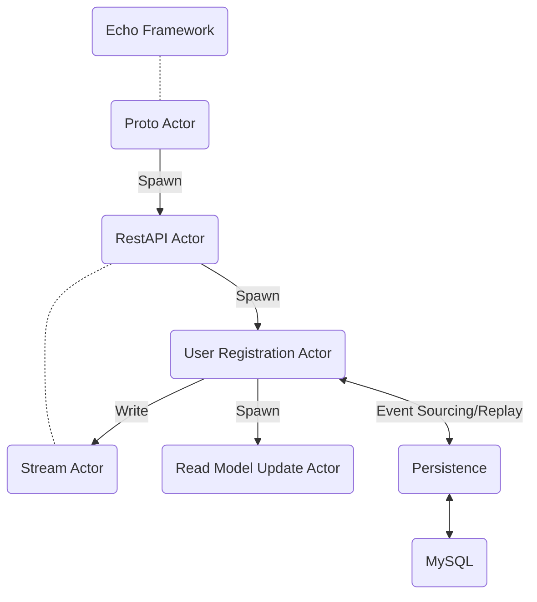
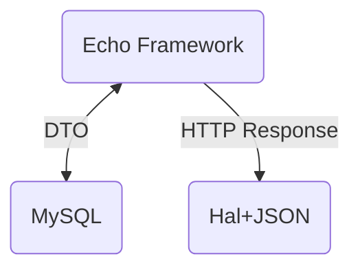

# protoactor-go-cqrs-example

This repository is a sample implementation of the CQRS pattern using protoactor-go(Actor Model).  
implementing simple user registration and user list retrieval.  
Tactical DDD layers are not implemented.

- use actor model to easily implement ES+CQRS(protoactor-go)
- use [sqlc](https://github.com/sqlc-dev/sqlc) to generate code from sql.

このリポジトリは、protoactor-goを使ってCQRSパターンを実装したサンプルです(アクターモデル)。  
簡単なユーザー登録とユーザー一覧取得を実装しています。  
戦術的DDDのパターンでは実装していません。

 - actorモデルを使って簡単なES+CQRSを実装します(protoactor-go)  
 - [sqlc](https://github.com/sqlc-dev/sqlc)を使ってsqlからコードを生成してあります。  

## Architecture

this sample uses MySQL for persistence,  
but uses different tables for Command / Query.  
Read Model updates are processed by the Read Model Update Actor using Event Sourcing replay etc.

CommandとQueryの2つのパターンで実装しています。  
MySQLを使って永続化していますが、  
Command / Queryで異なるテーブルを利用しています。  
Read Modelの更新は、Event Sourcingのリプレイなどを使って、Read Model更新アクターが処理しています。  

### Command 



### Query



## How to run

```bash
$ docker-compose up -d
$ go run cmd/main.go
```

## Post a command / create user

In this sample, an actor is generated and persisted for each email address.  
The same actor cannot be generated, so you cannot register with the same email address.

このサンプルではメールアドレスごとにアクターが生成、永続化されます。  
同じアクターは生成できない仕組みにしているため、同じメールアドレスで登録することはできないようになっています。  

```bash
$ curl --request POST \
  --url http://127.0.0.1:1323/user/registration \
  --header 'Content-Type: application/json' \
  --data '{
	"username": "test",
	"email": "test@example.com"
}'
```

## Get a query

```bash
$ curl --request GET \
  --url http://127.0.0.1:1323/users 
```

this sample returns hal+json,  
but you can implement it with GraphQL or gRPC etc.  
There are no restrictions on the response format.

このサンプルではhal+jsonを返していますが、  
GraphQLやgRPCなどでも実装可能です。  
レスポンスフォーマットには特に制限はありません。

```json
{
  "_embedded": {
    "users": {
      "_links": {
        "self": {
          "href": "/users/1"
        }
      },
      "created_at": "2024-02-26T23:44:07+09:00",
      "email": "test@example.com",
      "id": "01HQJXYYX2BQEYCWTX34P9Z7DE",
      "name": "test"
    }
  },
  "_links": {
    "self": {
      "href": "/users"
    }
  },
  "count": 1,
  "total": 1
}
```
